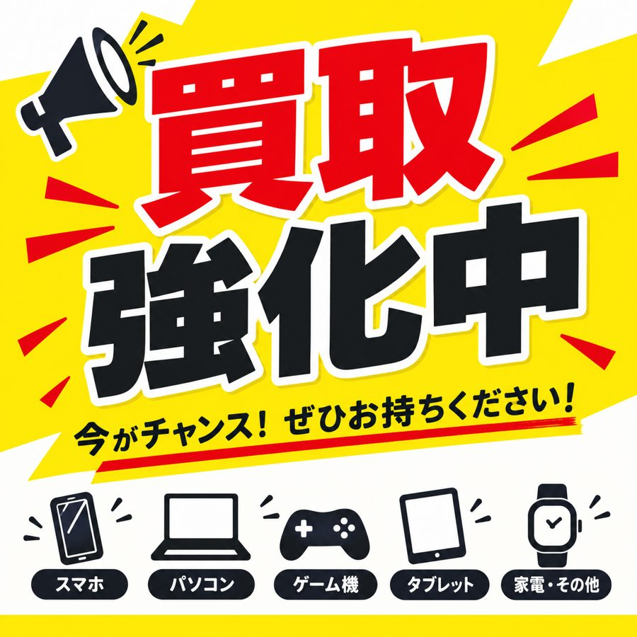
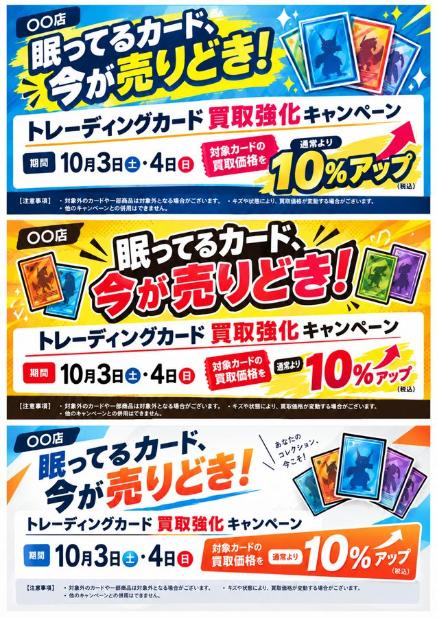
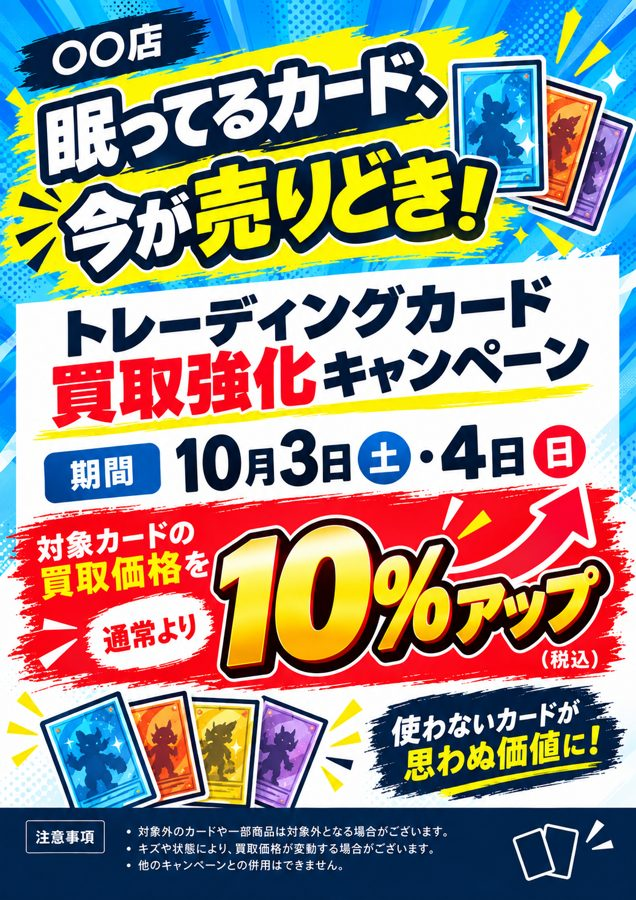
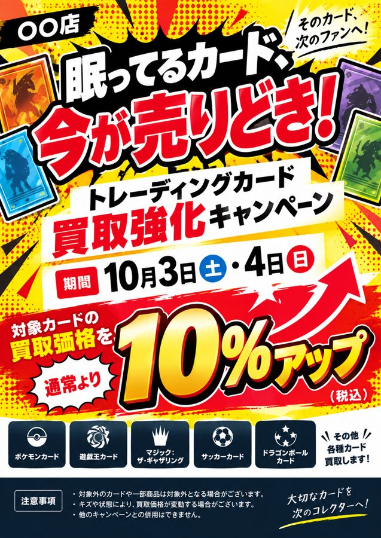
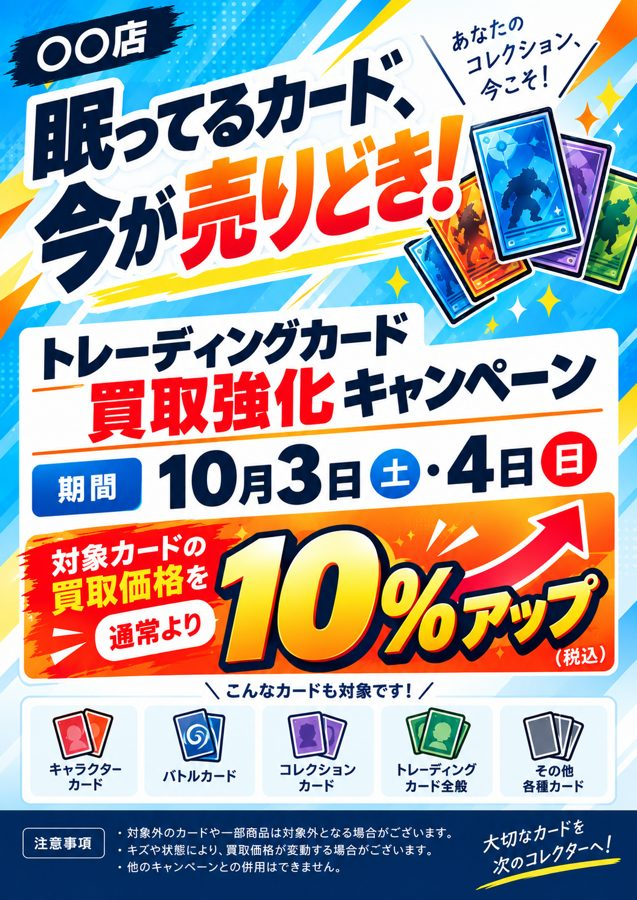

# 【ワーク③】画像生成プロンプト集（作例つき）

公開されているプロンプトと作例を、目的別にまとめました。気になる作例のプロンプトをコピーし、店名・商品名・文言などを自店の内容に置き換えて使ってください。

- 英語で公開されている公式ガイド（OpenAI・Google）のプロンプトは、日本語に訳して載せています。
- 作例の画像は、各出典のページから表示しています。画像とプロンプトの権利は、それぞれの出典・作者にあります（一覧は[出典](#sources)）。

## もくじ

- [1. チラシ・フライヤーを作るとき](#flyer)
  - [チラシ用プロンプトの型](#flyer-template)／[講師デモ：買取強化のPOPができるまで](#flyer-demo)／[チラシ・ポスターの作例](#flyer-examples)／[チラシの素材づくり](#flyer-parts)／[チラシでよく使う言い方](#flyer-words)
- [2. 書き方の基本（公式ガイドより）](#basics)
- [3. 言い方でこう変わる（修飾語・デザイン用語）](#words)
  - [光（照明）](#w-light)／[カメラ・撮り方](#w-camera)／[色味・フィルム](#w-color)／[素材・質感](#w-material)／[画風](#w-style)／[文字](#w-text)／[レイアウト](#w-layout)／[雰囲気と「避けたいこと」](#w-tone)
- [4. 作例集](#examples)
  - [販促ポスター・広告](#ex-ad)
  - [商品写真・商品ページ](#ex-product)
  - [ロゴ](#ex-logo)
  - [図解・インフォグラフィック](#ex-info)
  - [SNS・アプリ画面](#ex-ui)
  - [写真・リアルな表現](#ex-photo)
  - [キャラクター・漫画・ステッカー](#ex-chara)
  - [写真の編集（画像を添付して使う）](#ex-edit)
- [出典](#sources)

---

<a id="flyer"></a>

## 1. チラシ・フライヤーを作るとき

ワーク③ではチラシを作る方が多いので、チラシ向けの型・作例・言い方をまとめました。

<a id="flyer-template"></a>

### チラシ用プロンプトの型

（ ）の中を自店の内容に置き換えてください。使わない行は消して構いません。

```text
A4縦で印刷する、（店名）の「（イベント・キャンペーン名）」のチラシを作ってください。
（どこに貼る・配るか　例：店頭のレジ横に貼り、来店したお客様に見てもらいます）。
雰囲気は（例：明るくにぎやか／上品で落ち着いた／懐かしい昭和レトロ風）。配色は（色1）・（色2）・（色3）を中心にしてください。
チラシに入れる文字は、次のとおりです（そのまま使ってください）。
・見出し：「（見出し）」
・日付：「（〇月〇日（〇）〜〇月〇日（〇））」
・特典：「（特典の内容）」
・店名：「（店名）」
・注意書き：「（注意書き）」
見出しをいちばん大きく上部に、日付と特典をその次に目立たせ、店名と注意書きは下部にまとめてください。
右下に、QRコードを置くための空白を残してください。
小さな文字や数字も正確に読めるようにし、同じ文字をくり返したり、余計な文字を入れたりしないでください。
実在のキャラクターや他社のロゴは使わず、オリジナルのデザインにしてください。
まず1案作ってください。
```

別の案がほしいときは、続けて「次のデザインもお願いします」と送ります。一度に「3案」と頼むと、1枚の画像に3案がまとめて出ることがあります（下の講師デモを参照）。

<a id="flyer-demo"></a>

### 講師デモ：買取強化のPOPができるまで

スライドの講師デモで実際に作ったものです。

| ① ひと言だけで頼んだ場合 | ② 情報を足して頼んだら、3案が1枚にまとまった |
|:---:|:---:|
|  |  |

| ③「別々のA4で作成してください」→ 案1 | 「次のデザインもお願いします」→ 案2 | 「次のデザインもお願いします」→ 案3 |
|:---:|:---:|:---:|
|  |  |  |

**① ひと言だけのプロンプト**:
```text
買取強化のPOPを作って
```

**② 情報を足したプロンプト**:
```text
あなたは中古ホビーショップの販促担当です。
今週末の「トレーディングカード買取強化キャンペーン」の告知POPを作りたいです。レジ横に掲示し、来店したお客様に見てもらいます。
店名は〇〇店、期間は10月3日（土）・4日（日）、内容は「対象カードの買取価格を通常より10%アップ」です。
前回好評だったPOPの見出しは「眠ってるカード、今が売りどき！」でした。この雰囲気に合わせてください。
見出しは15文字以内、価格は税込表記にしてください。「業界最高値」などの断定表現や、実在のキャラクター・ロゴは使わないでください。
A4縦で印刷する前提で、見出し・本文・注意書きに分けて3案出してください。
```

**③ 続けて送ったひと言**:
```text
別々のA4で作成してください
```
```text
次のデザインもお願いします
```

**ポイント**：①は店名・期間・条件が入らず、どの店でも使える見た目になります。②で店名・期間・内容・お手本の見出し・守ることを渡すと、自店のPOPになります。③のように、会話で1つずつ直していきます。

<a id="flyer-examples"></a>

### チラシ・ポスターの作例

<a id="ex-autumn"></a>

#### 季節の販促ポスター（特典バッジ入り）


**プロンプト**（公開されている作例を日本語に訳したもの）:
```text
[コーヒーショップ]の、プロらしい販促ポスターをデザインしてください。
構図：素朴な木のテーブルの上で湯気の立つカプチーノを、映画のようにクローズアップ。背景には秋の落ち葉（くつろげる雰囲気）。
文字の入れ方：
1. メインタイトル：「Autumn Special」を、上部に上品な金色のセリフ体（明朝体のような書体）で。
2. 特典：「Buy One Get One Free」を、横にモダンなバッジ（ステッカー）風ではっきりと。
3. フッター：「Limited Time Only」を、下部に小さくすっきりした文字で。
仕上がり：すべての文字のつづりを正確に、中央にそろえ、写真の奥行きになじませてください。
```

**ポイント**：文字を「メインタイトル／特典／フッター」の3段階に分け、それぞれの位置と書体を指定する。特典は「バッジ（ステッカー）風」にすると目立つ。

**自店で使うなら**：「秋の買取強化」「2点以上で買取10%アップ」「期間限定」など、日本語の文言と自店の商品写真の場面に置き換えます。

**出典**：[awesome-nanobanana-pro](https://github.com/ZeroLu/awesome-nanobanana-pro)（MIT License）／元の記事：[WeChat Article](https://mp.weixin.qq.com/s/lrYNbs4rGs3KOqewoZ6aNQ)

#### そのほかのチラシ・ポスター向けの作例

| 作例 | 参考になるところ |
|---|---|
| [新商品ドリンクのポスター](#ex-drink) | 入れる文字を全部「」で並べる、細字（注意書き）の指定、「安っぽくしない」 |
| [高級感のある商品ポスター](#ex-luxury) | 価格と特典の階層、高級感の出し方 |
| [ブランドの広告（キャッチコピー入り）](#ex-brand-ad) | 客層・雰囲気・コピーを「指示書」のように書く |
| [看板のモックアップ](#ex-billboard) | 文字を「正確にそのまま」と指定し、書体と配置まで書く |
| [季節のカード](#ex-card) | 「場面／雰囲気／スタイル／守ること」に分けて書く |
| [文字がぎっしり入った画像](#ex-dense) | メニューや価格表のように、文字の多いチラシの例 |

<a id="flyer-parts"></a>

### チラシの素材づくり

<a id="ex-phone-product"></a>

#### スマホで撮った商品写真を、白背景の商品写真にする


**プロンプト**（公開されている作例を日本語に訳したもの。写真を添付して使います）:
```text
添付した写真の中の、主な商品を見つけてください（手で持っている部分や、散らかった背景は取り除きます）。高級感のあるECサイト用の商品写真として作り直してください。
切り抜き：指や手、余計な物をすべて取り除き、商品だけをきれいに切り抜いてください。
背景：真っ白なスタジオの背景（RGB 255, 255, 255）に置き、底にうっすらと自然な接地の影をつけてください。
照明：やわらかい商業用のスタジオ照明で、商品の質感と素材を引き立ててください。強い反射がなく、全体が均一に明るくなるように。
仕上げ：レンズのゆがみを直し、くっきりさせ、色味を整えて、新品のようにきれいに見せてください。
```

**ポイント**：取り除く物・背景・照明・仕上げを分けて指定する。

**自店で使うなら**：中古品の場合は、最後の行を「商品の状態やキズは、実物のまま変えないでください」に書き換えましょう。

**出典**：[awesome-nanobanana-pro](https://github.com/ZeroLu/awesome-nanobanana-pro)（MIT License）／元の記事：[WeChat Article](https://mp.weixin.qq.com/s/lrYNbs4rGs3KOqewoZ6aNQ)

<a id="ex-menu-en"></a>

#### 店頭のメニュー・価格表を英語版にする

| 添付した写真 | できあがり |
|:---:|:---:|
|  |  |

**プロンプト**（公開されている作例を日本語に訳したもの。写真を添付して使います）:
```text
壁のメニューにある中国語の料理名を、外国人観光客向けに英語へ翻訳してください。
質感：ここが重要です。壁や紙の古びた、使い込まれた質感はそのままに。英語の文字も同じ面に書かれた（印刷された）ように、少しかすれや色あせをつけてなじませてください。
通貨：「¥」の記号と価格の数字はそのまま残し、通貨は換算しないでください。
配置：英語の訳は、中国語の横に添えるか、自然に置き換えてください。
```

**ポイント**：「質感はそのまま」「価格の数字は変えない」と、変えない所をはっきり書く。

**自店で使うなら**：店頭の買取価格表や案内チラシの英語版づくり（インバウンド対応）に。「中国語」を「日本語」に置き換えて使います。

**出典**：[awesome-nanobanana-pro](https://github.com/ZeroLu/awesome-nanobanana-pro)（MIT License）／元の記事：[WeChat Article](https://mp.weixin.qq.com/s/lrYNbs4rGs3KOqewoZ6aNQ)

そのほか、[商品の切り抜き（背景を透明に）](#ex-cutout)や、[文字だけ翻訳（レイアウトはそのまま）](#ex-translate)もチラシの素材づくりに使えます。

<a id="flyer-words"></a>

### チラシでよく使う言い方

| 目的 | 言い方の例 |
|---|---|
| サイズ・使う場所 | 「A4縦で印刷する」「店頭のレジ横に貼る」「SNS用に正方形で」 |
| 情報の優先順位 | 「見出しをいちばん大きく上部に」「日付と特典を次に目立たせる」「店名と注意書きは下部にまとめる」 |
| 特典を目立たせる | 「『10%アップ』をバッジ（ステッカー）風に」「数字を大きく、赤で」 |
| 文字を正確に | 「入れる文字は次のとおり（そのまま使う）」「小さな文字や数字、価格も正確に」「同じ文字をくり返さない」 |
| 空けておく場所 | 「右下にQRコード用の空白を残す」「あとで写真を入れる枠を空けておく」 |
| 雰囲気 | 「明るくにぎやか」「上品で落ち着いた」「懐かしい昭和レトロ風」 |
| 案を増やす | 「まず1案」→「次のデザインもお願いします」 |

光・色味・書体・レイアウトなどの言い方と比較画像は、[3章](#words)にまとめています。

---

<a id="basics"></a>

## 2. 書き方の基本（公式ガイドより）

OpenAI と Google の公式ガイドに共通するポイントです。

| # | ポイント | ひと言でいうと |
|---|---|---|
| 1 | **何に使う画像かを最初に書く**（商品写真・広告・図解・ロゴなど）。縦長・横長などの比率や、配置の条件も書く | 完成形から伝える |
| 2 | **「場面・背景 → 主役 → 細部 → 守ること」の順に書く**。Google の型は「主役＋動き＋場所・状況＋構図＋スタイル」 | 順番をそろえる |
| 3 | **単語を並べるより、文章で情景を説明する** | 箇条書きの単語より文章 |
| 4 | **素材・光・色・画材を具体的に書く**（例：「スーツ」ではなく「紺のツイードのスーツ」）。写真にしたいときは「写真のようにリアルに」と明記する | ぼんやりした言葉を具体的に |
| 5 | **入れたい文字は「」で囲み、位置と書体も書く**。「文字は1回だけ」「余計な文字は入れない」も添え、できあがりのつづりを確認する | 文字は正確に指定 |
| 6 | **場面は「ある」形で書く**（「車がいない」より「人通りのない静かな通り」）。入れたくない物（余計な文字・透かし・ロゴ）は最後にまとめて書く | 描写は肯定形、除外は最後に |
| 7 | **「オリジナルのデザインで」「実在のキャラクター・商標・ロゴは入れない」と書く**。OpenAI の作例にも毎回書かれています | 権利に配慮した指定 |
| 8 | **直すときは1回に1か所**。「〇〇だけ変えて」と伝え、変えない所（顔・形・レイアウト・文字など）も書き添える | 少しずつ直す |

**例：1か所だけ直す（OpenAI の作例）**

| 1回目：看板のモックアップ | 2回目：「冬の夕方で、雪が降っている様子にしてください。」 |
|:---:|:---:|
|  |  |

変えたい条件だけを伝えると、看板・文字・構図はそのままで季節と時間だけが変わります。1回目のプロンプトは[作例集](#ex-billboard)に載せています。

---

<a id="words"></a>

## 3. 言い方でこう変わる（修飾語・デザイン用語）

同じ被写体でも、プロンプトに入れる言葉で仕上がりが大きく変わります。公式ガイドの比較例と、販促物でよく使う言い方をまとめました。

<a id="w-light"></a>

### 光（照明）


左から「元の写真」→「ゴールデンアワーの逆光」（2パターン）→「フィルムノワール風の照明」。同じ瓶でも、光の言い方だけで印象が変わります。（Google Cloud 公式ガイドより）

| 言い方 | こうなる | 向いている用途 |
|---|---|---|
| スタジオ照明、3点照明のソフトボックス | 商品全体がムラなく明るく、影がやわらか | 商品写真・EC |
| 長い影ができる、ゴールデンアワーの逆光 | 夕方の温かい光で、ふんわりした雰囲気 | ドリンク・雑貨・季節の告知 |
| 強いコントラストの明暗（キアロスクーロ） | 背景が暗く、主役だけが浮かび上がる | 高級品・限定品 |
| フィルムノワール風の照明 | 白黒映画のような、渋く劇的な印象 | 大人っぽい演出 |
| 窓からの自然光、フラッシュなし | やわらかく自然で、生活感がある | SNS・メモ風の写真 |
| 夜のネオンの光 | 色つきの光が映り込む、にぎやかな夜 | イベント・ゲーム関連 |

<a id="w-camera"></a>

### カメラ・撮り方


左から「元の写真」→「使い捨てカメラ」→「アクションカメラ（GoPro）の広角レンズ」→「インスタント写真（ポラロイド）」。（Google Cloud 公式ガイドより）

| 言い方 | こうなる |
|---|---|
| 写真のようにリアルに | イラストではなく写真として描かれる（リアルにしたいときは明記するのがコツ） |
| スマホで撮った素人写真 | 作り込みすぎない、SNSに投稿したような自然さ |
| 使い捨てカメラ風／インスタント写真風 | フラッシュの写り、懐かしい色味、白いフチの写真 |
| クローズアップ／引きの構図 | 主役を大きく／周りの様子まで広く |
| 真上から（俯瞰）／ローアングル | 並べた商品を見せる／主役を大きく堂々と見せる |
| 背景をぼかす（浅い被写界深度） | 主役が際立つ |
| 広角レンズ／マクロレンズ | 広い空間の迫力／小さな物の細部 |
| 50mmレンズ、目線の高さ | 人の目で見たような自然な距離感 |

<a id="w-color"></a>

### 色味・フィルム


左から「元の写真」→「画面に差し込む暖かいオレンジ・赤の光、高感度フィルムの粒子」→「コントラストの強いティール＆オレンジの色調、もや、16mmフィルムの粒子」。（Google Cloud 公式ガイドより）

| 言い方 | こうなる |
|---|---|
| 1980年代のカラーフィルムで撮ったように、少し粒子感 | 懐かしいレトロな写真 |
| くすんだ青緑を基調にした、映画のような色調 | 落ち着いた、今っぽい雰囲気 |
| 低彩度で上品な配色 | 落ち着いた高級感 |
| パステルカラー | やさしく、かわいい印象 |
| 配色を3色で指定（例：ダークグリーン・オフホワイト・ゴールド） | ブランドらしい統一感 |
| モノクロ | 渋く、文字が映える |

<a id="w-material"></a>

### 素材・質感


左の白いマークを、素材の言い方だけ変えて作り直した例（金属・革・雲・ダイヤモンド・テニスボールのフェルト・アイスクリーム）。（Google Cloud 公式ガイドより）

| 言い方 | こうなる |
|---|---|
| 「スーツ」ではなく「紺のツイードのスーツ」 | 素材まで書くと、手ざわりまで伝わる |
| 金属・ガラス・木・紙・布（フェルト）など | 手に取ったときの質感が出る |
| 和紙の質感 | 和の上品さ |
| 使い込んだ、少し塗装がはげた | ヴィンテージ感 |
| マットな／つやのある | 落ち着いた質感／光を反射する高級感 |

<a id="w-style"></a>

### 画風


左上から「元の写真」→「セルアニメ風」→「クレイアニメ風」→「ぬいぐるみ風」。（Google Cloud 公式ガイドより）

| 言い方 | こうなる | 作例 |
|---|---|---|
| かわいい（kawaii）スタイル、太くすっきりした輪郭線、セル画風の塗り | ステッカーやLINEスタンプのような絵 | [ステッカー](#ex-sticker) |
| 手描きの水彩風、やわらかい輪郭線、温かいアースカラー | 絵本のようなやさしい絵 | [絵本のキャラクター](#ex-picturebook) |
| ドット絵（ピクセルアート） | レトロゲームのような絵 | [ドット絵アイテム](#ex-pixel) |
| フラットデザイン、ベクター風のシンプルな形 | ロゴやアイコン向けのすっきりした絵 | [ロゴ](#ex-logo) |
| 白黒の線画 | ぬり絵やポストカード向けの絵 | |
| 3Dレンダリング、クレイ風 | 立体的で、おもちゃのような質感 | |
| アイソメトリック（斜め上から見た立体図） | 店内マップや図解向けの立体的な絵 | |
| 昭和レトロ風、レトロゲーム風 | 懐かしさを感じる、にぎやかな絵 | |

特定の作品名や作家名で「〇〇風に」と頼むのは避け、上のような一般的な言い方で画風を伝えましょう。

<a id="w-text"></a>

### 文字（タイポグラフィ）


1行ずつ書体を指定した例（筆記体・極太・細いゴシック）。同じ指示で、韓国語・アラビア語にも作り直しています。（Google Cloud 公式ガイドより）


「黒い背景に太い文字で"New York"。文字の形の中にだけ、街の写真が見えるように」と、文字そのものをデザインにした例。（Google Cloud 公式ガイドより）

| 言い方 | こうなる |
|---|---|
| 入れる文字を「」で囲み、「そのまま使う」と書く | 文字が正確に入りやすい |
| 太いゴシック体／明朝体／丸ゴシック／手書き風／筆文字 | 書体の雰囲気が変わる |
| 「見出しをいちばん大きく中央上に」「価格は赤で大きく」「注意書きは下に小さく」 | 読ませたい順番どおりの配置になる |
| 「文字は1回だけ」「余計な文字は入れない」 | 同じ文字の重複や、意味のない文字を防ぐ |
| 「小さな文字や数字、価格も正確に読めるように」 | 細部の文字化けを減らす |

<a id="w-layout"></a>

### レイアウト・デザイン用語

| 余白を大きくとる（Google の作例） | 階層・余白・控えめな色（OpenAI の作例） |
|:---:|:---:|
|  |  |

| 言い方 | こうなる |
|---|---|
| 余白を大きく（ネガティブスペース） | すっきり上品になり、あとから文字を載せる場所もできる |
| 情報の優先順位（見出し → 価格 → 注意書き） | 遠くからでも要点が伝わる |
| カード型・モジュール型のレイアウト、角丸 | 情報が区切られて読みやすい |
| グリッド（例：10×10のマス目） | 一覧表・カタログ風になる |
| エリアで指定（上部に〜、左に〜、下部に〜） | 狙いどおりの配置になる |
| 比率を指定（縦長3:4、正方形、横長16:9） | POP・SNS・動画サムネイルなど、用途に合う形になる |
| シンプルに、装飾は最小限に | 伝えたい情報がまっすぐ届く |

<a id="w-tone"></a>

### 雰囲気と「避けたいこと」

| 言い方 | こうなる |
|---|---|
| 高級感、上品、抑制の効いた | 落ち着いた配色で、余白が多め |
| 親しみやすい、温かい | やわらかい色と形 |
| ポップ、元気 | 明るい色で、大きな文字 |
| 懐かしい、レトロ | 色あせやフィルムの質感 |
| 誠実、信頼感のある | 紺や白を使った、整ったレイアウト |

入れたくないことは、最後にまとめて書くと効きます。公開されている作例でよく使われている言い方です。

- 「安っぽくしない」「詰め込みすぎない」「ECサイトっぽくしない」
- 「作り込みすぎない」「加工しすぎない」（自然な写真にしたいとき）
- 「余計な文字、透かし、関係のないロゴは入れない」
- 「オリジナルのデザインで、実在のキャラクターや商標は使わない」

---

<a id="examples"></a>

## 4. 作例集

「ポイント」には、3章のどの言い方が効いているかを書いています。「自店で使うなら」は、置き換えのヒントです。

<a id="ex-ad"></a>

### 販促ポスター・広告

チラシ向けの作例と書き方は、[1章](#flyer)にもまとめています。

<a id="ex-drink"></a>

#### 新商品ドリンクのポスター


**プロンプト**（公開されている作例をそのまま掲載）:
```text
新しい中国トレンド茶のローンチ用 3:4 縦ポスターをデザインする。軽い高級感と抑制の効いた New Chinese ビジュアルスタイルにする。配色はダークグリーン、オフホワイト、ゴールド。ライスペーパーの質感、上品な余白、山水モチーフ、モダンなレイアウトを使う。

主役:
茶葉、柑橘、氷、少量の金箔が入った魅力的なコールドブリューティー。

ポスターには以下の正確な中国語コピーを入れること:
"山川茶事"
"山柚观音"
"冷泡系列"
"新品上市"
"一口清醒，半城入夏"
"限定尝鲜价"
"中杯 16 元"
"大杯 19 元"
"门店活动"
"第二杯半价"
"加 3 元升级轻乳版"
"每日前 100 名赠限定杯套"
"推荐风味"
"观音茶底 / 西柚果香 / 轻乳云顶 / 冰感回甘"
"活动时间 4月20日 至 5月10日"
"扫码点单"
"SHANCHUAN TEA"

細字:
"图片仅供参考，请以门店实际售卖为准"

販促の階層は明確に保ちつつ、安っぽくしたり EC すぎる見た目にしないこと。小さい文字、数字、価格、情報モジュール、中国語タイポグラフィに特に注意する。
```

**ポイント**：3色の配色、「ライスペーパーの質感」「上品な余白」、入れる文字を「」で正確に並べる、「細字（注意書き）」の指定、「販促の階層は明確に、安っぽくしない」。

**自店で使うなら**：中国語のコピーを、店名・商品名・価格・期間などの日本語に置き換えます（例：「新弾入荷」「〇月〇日発売」「店頭予約受付中」）。

<a id="ex-luxury"></a>

**出典**：[Awesome GPT Image 2](https://github.com/ZeroLu/awesome-gpt-image/blob/main/README.ja.md)／元の投稿：[卡尔的AI沃茨](https://mp.weixin.qq.com/s/ASxig6mFVYxrIE8-8Fthew)

#### 高級感のある商品ポスター


**プロンプト**（公開されている作例をそのまま掲載）:
```text
"澄光维稳精华" の高級スキンケア EC ヒーローポスターを作成する。スタイルはクリーンで軽い高級感があり、サイエンス系スキンケアの印象を強く出す。中央に金色の液体が入った半透明フロストガラスの美容液ボトルを置き、微細な水滴反射を加える。背景はオフホワイトからウォームグレーへのグラデーションにし、液体の流れと分子構造の装飾を加える。

以下の正確な中国語コピーを入れる:
"澄光"
"维稳精华"
"修护屏障"
"舒缓泛红"
"细腻透亮"
"第 2 代升级配方"
"核心成分"
"神经酰胺"
"泛醇 B5"
"积雪草提取物"
"微囊脂质体"
"适合人群"
"敏感肌"
"熬夜肌"
"换季不稳定肌"
"限时到手价 229 元"
"买 1 送 3"
"赠洁面 15ml"
"赠精华 5ml"
"赠面霜 10g"

細字:
"实际效果因人而异，请坚持使用"

商品の訴求点、価格階層、ギフト一覧、商品名、短い機能訴求を明確にする。仕上がりは高級感があり、安っぽくもライブコマース風にもならないようにする。
```

**ポイント**：「クリーンで軽い高級感」「半透明のフロストガラス」「オフホワイトからウォームグレーのグラデーション」、価格と特典の階層を明確に。

**自店で使うなら**：限定品や高額商品の告知に。商品名・価格・特典（「先着〇名」など）を置き換えます。

<a id="ex-brand-ad"></a>

**出典**：[Awesome GPT Image 2](https://github.com/ZeroLu/awesome-gpt-image/blob/main/README.ja.md)／元の投稿：[卡尔的AI沃茨](https://mp.weixin.qq.com/s/ASxig6mFVYxrIE8-8Fthew)

#### ブランドの広告（キャッチコピー入り）


**プロンプト**（OpenAI 公式ガイドの作例を日本語に訳したもの）:
```text
Thread という名前のブランドの、今っぽい広告（ファッション写真）を作ってください。
Thread は若者向けのストリートブランドです。広告には友人グループがくつろいでいる様子を写し、キャッチコピー「Yours to Create.」を入れます。
若いストリートファッション層に向けた、洗練されたキャンペーン画像のように仕上げてください。スタイリッシュで今っぽく、エネルギッシュで、品よく。
すっきりした構図、はっきりした色の方向性、自然なポーズ、上質なファッション写真の雰囲気で。
キャッチコピーは広告のレイアウトになじませ、はっきり読めるように1回だけ入れてください。
余計な文字、透かし、関係のないロゴは入れないでください。
```

**ポイント**：広告は「指示書」のように、ブランド・客層・雰囲気・場面・コピーを書く。「コピーは1回だけ」「余計な文字は入れない」。

**自店で使うなら**：ブランド名を店名に、客層を「トレカ好きの常連さん」などに、キャッチコピーを自店の言葉に置き換えます。

**出典**：[OpenAI「Image prompting」](https://developers.openai.com/api/docs/guides/image-prompting)

<a id="ex-billboard"></a>

#### 看板のモックアップ（商品写真を添付）

| 添付した商品写真 | できあがり |
|:---:|:---:|
|  |  |

**プロンプト**（OpenAI 公式ガイドの作例を日本語に訳したもの）:
```text
夕焼けの高速道路の風景に、このシャンプーの看板のリアルなモックアップを作ってください。
看板の文字（正確にそのまま、余計な文字なし）：
"Fresh and clean"
書体：太いサンセリフ体、高コントラスト、中央ぞろえ、きれいな字間。
文字は1回だけ、はっきり読めるように入れてください。
透かしやロゴは入れないでください。
```

**ポイント**：文字を「正確にそのまま」と指定し、書体・配置まで書く。続けて「冬の夕方で、雪が降っている様子にしてください」とだけ送ると、[2章の例](#basics)のように季節だけが変わります。

**自店で使うなら**：店頭の大型POPや、のぼり・看板の完成イメージづくりに。

**出典**：[OpenAI「Image prompting」](https://developers.openai.com/api/docs/guides/image-prompting)

<a id="ex-card"></a>

#### 季節のカード


**プロンプト**（OpenAI 公式ガイドの作例を日本語に訳したもの）:
```text
クリスマスカードのイラストを作ってください。

場面：
思い出の箱の中に、古いテディベアが座っている心温まるクリスマスの場面。毛並みは少しすり減り、ていねいに繕ったあとがあります。窓のそばに置かれ、外では雪が降っています。子どもは大きくなったけれど、思い出は残っている――そんな気持ちが伝わるように。

雰囲気：
温かく、懐かしく、やさしく、心に響く。

スタイル：
上質なホリデーカードの写真、やわらかく映画のような照明、リアルな質感、浅い被写界深度、上品なボケの光、印刷に耐える構図。

守ること：
・オリジナルの作品のみ
・商標は入れない
・透かしは入れない
・ロゴは入れない

カードに入れる文字は、これだけ（そのまま）：
"Merry Christmas — some memories never fade."
```

**ポイント**：「場面／雰囲気／スタイル／守ること」を見出しで分けて書く。入れる文字は「これだけ」と限定する。

**自店で使うなら**：年末のご挨拶カードや、周年の感謝カードに。場面と入れる文字を置き換えます。

**出典**：[OpenAI「Image prompting」](https://developers.openai.com/api/docs/guides/image-prompting)

<a id="ex-product"></a>

### 商品写真・商品ページ

#### スタジオで撮ったような商品写真


**プロンプト**（Google 公式ガイドの作例を日本語に訳したもの）:
```text
高解像度の、スタジオ照明で撮った商品写真。マットブラックのミニマルな陶器のマグカップを、磨かれたコンクリートの上に置きます。照明は3点のソフトボックスで、やわらかく広がるハイライトを作り、強い影をなくします。カメラは45度のやや上からの角度で、すっきりした形を見せます。超リアルに、コーヒーから立ちのぼる湯気にピントを合わせます。正方形の画像。
```

**ポイント**：「スタジオ照明」「3点のソフトボックス」「45度のやや上から」「ピントを合わせる場所」の指定。

**自店で使うなら**：商品と置く場所を、自店の商品（例：「未開封のフィギュアの箱」「木の台の上」）に置き換えます。

**出典**：[Google Developers Blog](https://developers.googleblog.com/en/how-to-prompt-gemini-2-5-flash-image-generation-for-the-best-results/)

<a id="ex-cutout"></a>

#### 商品の切り抜き（背景を透明に）

| 添付した写真 | できあがり（背景が透明） |
|:---:|:---:|
|  |  |

**プロンプト**（OpenAI 公式ガイドの作例を日本語に訳したもの）:
```text
入力画像から商品を切り抜き、完全に透明な背景の上に配置してください。
仕上がり：商品は中央に、輪郭はくっきりと。ふちに色のにじみや白いふちを出さないでください。
商品の形とラベルの読みやすさは、そのまま正確に保ってください。
仕上げの調整は軽くだけにしてください。無地の背景、市松模様、風景、影は加えないでください。
商品のデザインは変えず、背景だけを取り除いて、きれいな透明にしてください。
```

**ポイント**：「形とラベルは変えない」「背景・影は足さない」と、変えない所をはっきり書く。

**自店で使うなら**：店内で撮った中古商品の写真を、ECやPOP用に切り抜くときに。

**出典**：[OpenAI「Image prompting」](https://developers.openai.com/api/docs/guides/image-prompting)

#### コレクション商品のパッケージ


**プロンプト**（OpenAI 公式ガイドの作例を日本語に訳したもの）:
```text
ヴィンテージ風のおもちゃのプロペラ機を、コレクション用のフィギュアとして作ってください。丸みのある翼、機首で回るプロペラ、少しはげた塗装のふち、昔ながらの子ども向けのプロポーションで、懐かしいホリデーの記念品として、ブリスターパッケージに入れます。

コンセプト：
冬休みに子どもたちが遊んだ、素朴なおもちゃの飛行機から着想を得た、懐かしいホリデーの記念品。温かさ、想像力、子どものころのわくわく感を感じさせます。

スタイル：
上質なおもちゃの商品写真、リアルなプラスチックと塗装した金属の質感、スタジオ照明、浅い被写界深度、くっきりしたラベル印刷、高級店のような見せ方。

守ること：
・オリジナルのデザインのみ
・商標は入れない
・透かしは入れない
・ロゴは入れない

パッケージに入れる文字は、これだけ（そのまま）：
"Christmas Memories Edition"
```

**ポイント**：素材（プラスチック・塗装した金属）と「使い込んだ感じ」を書く。「オリジナルのデザインのみ」「商標・ロゴは入れない」。

**自店で使うなら**：オリジナルグッズ、福袋、限定セットの完成イメージづくりに。

**出典**：[OpenAI「Image prompting」](https://developers.openai.com/api/docs/guides/image-prompting)

#### ECの商品詳細ページ

| プロテイン | AIメガネ | 夏のワンピース | コーヒーマシン |
|:--------------:|:----------:|:------------:|:--------------:|
|  |  |  |  |

**プロンプト**（公開されている作例をそのまま掲載）:
```text
[product name] の EC 商品詳細ページを生成する
```

**ポイント**：短い指示だけでも、AIが見出し・特長・スペック表などの構成を補ってくれる例。

**自店で使うなら**：`[product name]` を「中古のゲーム機本体」「トレカ用スリーブ」などに。細かい内容は、商品の情報を貼り付けて渡します。

<a id="ex-logo"></a>

**出典**：[Awesome GPT Image 2](https://github.com/ZeroLu/awesome-gpt-image/blob/main/README.ja.md)／元の投稿：[Article](https://x.com/MrLarus/status/2046627021674168640) | [@MrLarus](https://x.com/MrLarus/status/2046544209117634735)

### ロゴ

#### 地元のパン屋のロゴ

| 案1 | 案2 | 案3 | 案4 |
|:---:|:---:|:---:|:---:|
|  |  |  |  |

**プロンプト**（OpenAI 公式ガイドの作例を日本語に訳したもの）:
```text
地元のパン屋「Field & Flour」の、オリジナルで他者の権利を侵害しないロゴを作ってください。
温かく、シンプルで、長く使える印象に。すっきりしたベクター風の形、はっきりしたシルエット、バランスのよい余白を使います。
細かさよりシンプルさを優先し、小さくしても大きくしてもはっきり分かるように。フラットデザインで線は最小限に、グラデーションは必要なとき以外使わないでください。
背景は完全に透明にしてください。中央にロゴを1つだけ置いて周りに十分な余白をとり、ふちはきれいに。無地の背景、風景、市松模様、透かしは入れないでください。
```

**ポイント**：「オリジナルで権利を侵害しない」「フラットデザイン」「余白」「小さくしても分かる」。

**自店で使うなら**：店名と業種を置き換えます。イベント名やキャンペーンのロゴにも使えます。

**出典**：[OpenAI「Image prompting」](https://developers.openai.com/api/docs/guides/image-prompting)

#### コーヒーショップのロゴ（文字入り）


**プロンプト**（Google 公式ガイドの作例を日本語に訳したもの）:
```text
「The Daily Grind」という名前のコーヒーショップの、モダンでミニマルなロゴを作ってください。文字は、すっきりした太いサンセリフ体に。コーヒー豆をシンプルに図案化したアイコンを、文字と自然に組み合わせてください。配色は白と黒。
```

**ポイント**：店名を「」で指定し、書体と配色、アイコンの組み合わせ方まで書く。

**出典**：[Google Developers Blog](https://developers.googleblog.com/en/how-to-prompt-gemini-2-5-flash-image-generation-for-the-best-results/)

<a id="ex-info"></a>

### 図解・インフォグラフィック

#### 「1杯のコーヒーが届くまで」の図解


**プロンプト**（公開されている作例をそのまま掲載）:
```text
「一杯咖啡 如何来到你手里」（1 杯のコーヒーがどのようにあなたの手に届くか）をテーマにした中国語インフォグラフィックポスターを作る。教育的な明快さと商業的な魅力を両立した上質な情報デザインにする。レイアウトには流れ、矢印、データボックス、アイコン、シンプルなイラスト、モジュールカードを含める。コーヒーブラウン、ミルクホワイト、インクブラック、銅色のアクセントを使用する。

含める内容:
- 01 栽培: 標高 1200-2200m、適温 18-24C、収穫期 11 月〜3 月
- 02 精製: ナチュラル、水洗い、ハニープロセス
- 03 焙煎: 浅煎り = より明るい、中煎り = バランス、深煎り = より濃厚
- 04 挽き方: ハンドドリップ = 粗挽き、エスプレッソ = 細挽き、コールドブリュー = 中粗挽き
- 05 抽出: 粉と水の比率、水温、時間が風味に影響する
- 風味キーワード: floral / citrus / nutty / caramel / chocolate / smoky

以下の細字をそのまま使う:
"适合用于咖啡入门科普与门店展示"

文字とビジュアルのバランスを保ちつつ、上品に仕上げる。長いインフォグラフィック、数値、温度、番号付きセクション、短い説明、スラッシュ区切りの風味語、モジュールレイアウトの扱いに注意する。教室のスライドではなく、高級ディスプレイボードのように見せる。
```

**ポイント**：載せる内容を番号付きで全部渡す、配色を4色で指定、「教室のスライドではなく高級ディスプレイボードのように」。

**自店で使うなら**：「トレカが店頭に並ぶまで」「買取から販売までの流れ」などに置き換えます。

<a id="ex-translate"></a>

**出典**：[Awesome GPT Image 2](https://github.com/ZeroLu/awesome-gpt-image/blob/main/README.ja.md)／元の投稿：[卡尔的AI沃茨](https://mp.weixin.qq.com/s/ASxig6mFVYxrIE8-8Fthew)

#### 機械の仕組みの図解 → 文字だけ翻訳

| 1回目：仕組みの図解 | 2回目：文字だけスペイン語に |
|:---:|:---:|
|  |  |

**プロンプト**（OpenAI 公式ガイドの作例を日本語に訳したもの）:
```text
全自動コーヒーマシンの仕組みと流れを、詳しいインフォグラフィックにしてください。
豆を入れる部分から、粉砕、計量、水タンク、ボイラーなどまで。
流れを、技術的にも見た目にも理解できるようにしたいです。
```
```text
このインフォグラフィックの文字をスペイン語に翻訳してください。それ以外は変えないでください。
```

**ポイント**：翻訳するときは「それ以外は変えない」と書くと、レイアウトがそのまま残ります。原文ではメーカー名を例に挙げていますが、ここでは省いています。

**自店で使うなら**：店頭のチラシや案内の英語版づくり（インバウンド対応）に。

**出典**：[OpenAI「Image prompting」](https://developers.openai.com/api/docs/guides/image-prompting)

#### 図鑑風の知識カード

| 例1 | 例2 | 例3 | 例4 |
|:-----:|:-------:|:-----------------:|:-------------:|
|  |  |  |  |

**プロンプト**（公開されている作例をそのまま掲載）:
```text
[topic] の高品質な縦型百科事典スタイルのインフォグラフィックを生成する。

普通のポスターや単純なイラストではなく、フィールドガイドの明快さ、百科事典ページの構造、ライフスタイル知識カードの洗練、SNS で共有しやすい強い解説力を組み合わせた、モジュール型教育インフォグラフィックにする。

画像には以下を含める:
- 主題の明確で魅力的なメインビジュアル
- 複数の拡大ディテール callout
- 角丸のモジュール型情報セクション
- 強いタイトル階層と強調ラベル
- 簡潔だが情報量の多い教育コンテンツ
- スコア、即答ポイント、または Top 5 モジュール

トピックに応じて内容セクションを自動調整する。例: 基本プロフィール、分類、外観、習性または生態、形成メカニズムまたは構造、生育または使用条件、ケアまたは保守の助言、リスクと注意点、適した利用者またはユースケース、長所と短所、クイックスコアカード。

ビジュアル要件:
明るくクリーンな背景、柔らかい色、控えめな影、洗練された小アイコン、角丸カード、整ったレイアウト。情報密度は高くても窮屈に見えず、広告ではなく知識カードの形式として公開・収集・再利用できる見た目にする。

商業プロモーションポスターにはしない。知識の整理、モジュール情報、フィールドガイド風の提示を重視する。
```

**ポイント**：「広告ではなく知識カード」「角丸のモジュール」「見出しの階層」「Top 5 やスコア」。

**自店で使うなら**：`[topic]` を「トレカのレアリティの見分け方」「中古ゲーム機の選び方」などに。

**出典**：[Awesome GPT Image 2](https://github.com/ZeroLu/awesome-gpt-image/blob/main/README.ja.md)／元の投稿：[Article](https://x.com/MrLarus/status/2046627021674168640) | [@MrLarus](https://x.com/MrLarus/status/2046231542817497392)

#### 分解図（カタログ風）


**プロンプト**（公開されている作例をそのまま掲載）:
```text
[Subject] をもとに「museum catalog-style Chinese disassembly infographic」を自動生成してください。

画像全体では、リアルな主体ビジュアル、構造分解、中国語注釈、素材説明、模様の意味、色の意味、主要特徴の要約を統合する必要がある。[Subject] に応じて、最適な主体、服飾体系、器物構造、時代様式、主要部品、素材工芸、配色、レイアウトを自動判断すること。ユーザーは追加情報を与える必要がない。

全体のスタイルは、国家級博物館の展示ボード、歴史衣装カタログ、文化博物館系インフォグラフィックに寄せる。普通のポスター、古風人物画、EC 商品詳細、アニメイラストにはしない。背景にはオフホワイト、シルクホワイト、薄茶色などの紙の質感を用い、高級で節度があり、専門的でコレクション性のある見た目にする。

固定レイアウト:
- 上部: 中国語の主タイトル + サブタイトル + 導入文
- 左: 構造分解エリア。中国語の引き出し線で主要部品を注釈し、部分拡大も添える
- 右上: 素材 / 工芸 / テクスチャのエリア。実際の質感サンプルと説明を表示
- 右中: 模様 / 色彩 / 意味のエリア。主要配色、模様サンプル、文化的解説を表示
- 下部: 着装順 / 構成フローチャート + コア特徴の要約

主題が人物に向くなら実在感のある全身立ち姿を中央主体にし、器物や単体構造に向くなら中央分解図に切り替える。ただし全体形式は必ず完全な中国語インフォグラフィックとする。すべての文字は簡体字中国語で、明瞭・整然・可読であること。文字化け、誤字、英語、ピンインは禁止。実在構造、素材差、文化解説、カタログ感の強調を重視する。

避けるもの: ポスターっぽさ、スタジオポートレート感、EC 感、アニメ感、コスプレ感、ランダム注釈、誤った構造、ぼやけた文字、偽素材、過剰装飾。
```

**ポイント**：「上部／左／右上／下部」とエリアごとにレイアウトを固定して指定し、「避けるもの」も並べる。

**自店で使うなら**：`[Subject]` を「エレキギター」「フィギュアの付属品」などにし、文字を日本語で、と書き換えます。

**出典**：[Awesome GPT Image 2](https://github.com/ZeroLu/awesome-gpt-image/blob/main/README.ja.md)／元の投稿：[OpenNana](https://opennana.com/awesome-prompt-gallery/museum-level-chinese-disassembly-infographic) | [@MrLarus](https://x.com/MrLarus/status/2045504669401653414)

#### 授業プリント風の説明図


**プロンプト**（OpenAI 公式ガイドの作例を日本語に訳したもの）:
```text
高校生向けに、「細胞呼吸のしくみ」というタイトルのシンプルな生物の図を作ってください。

細胞の中でブドウ糖がエネルギーに変わる流れを示します。解糖系、クエン酸回路、電子伝達系を含めます。
矢印で各段階をつなぎ、主な物質（ブドウ糖、ピルビン酸、ATP、NADH、FADH2、CO2、O2、H2O）にラベルを付けます。
白い背景、シンプルなアイコン、はっきりしたラベル、読みやすい文字で、授業のプリントやスライドのようなすっきりした見た目にしてください。

小さすぎる文字や余計な装飾など、図を分かりにくくするものは避けてください。
```

**ポイント**：対象者・目的・入れるラベルを指定し、「小さすぎる文字や余計な装飾は避ける」。

**自店で使うなら**：スタッフ向けの手順書（例：「買取受付の流れ」）に置き換えます。

**出典**：[OpenAI「Image prompting」](https://developers.openai.com/api/docs/guides/image-prompting)

#### 旅行ガイド（短い指示でも情報たっぷり）

| 例1 | 例2 | 例3 |
|:------:|:------:|:------:|
|  |  |  |

**プロンプト**（公開されている作例をそのまま掲載）:
```text
[city] の 3 日間旅行ガイド画像を生成する
```

**ポイント**：1行の指示でも、AIが見出し・日程・写真・地図風の構成を補ってくれる例。

**自店で使うなら**：`[city]` を地元の町名にし、「お店の周辺マップ」「イベント当日の回り方」などに。

<a id="ex-ui"></a>

**出典**：[Awesome GPT Image 2](https://github.com/ZeroLu/awesome-gpt-image/blob/main/README.ja.md)／元の投稿：[Article](https://x.com/MrLarus/status/2046627021674168640) | [@MrLarus](https://x.com/MrLarus/status/2046523494003851300)

### SNS・アプリ画面

#### 昔の人がSNSに投稿したら


**プロンプト**（公開されている作例をそのまま掲載）:
```text
"Song Dynasty People's Moments" / "SONG DYNASTY SOCIAL MEDIA FEED"。古代と現代のタイムトラベル風ユーモアを融合した UI デザインスタイル。画像はスマホの SNS インターフェースを模しているが、内容はすべて宋代の場面。アイコンは宋代文人の肖像。ユーザー名は "Su Dongpo SuShi_Official"。投稿文は "Just arrived in Huangzhou, demoted but feeling okay. Made Dongpo pork myself today, tastes amazing, recipe attached:"。添付画像は工筆画風の東坡肉のクローズアップ。いいね一覧は "Huang Tingjian, Qin Guan, Fo Yin etc. 126 people"。コメント欄は "Wang Anshi: Hehe" "Sima Guang: Still the same taste"。いいねアイコンなどの UI 要素は宋代の文様に置き換える。ステータスバーには "Great Song Mobile 5G" と "Third Year of Yuanfeng" を表示する。配色はスマホのダークモードと上品な宋代トーンを組み合わせ、歴史と SNS の面白い衝突を表現する。
```

**ポイント**：SNS画面の要素（アイコン、ユーザー名、投稿文、いいね、コメント、ステータスバー）を1つずつ指定し、「昔と今のギャップ」を楽しませる。

**自店で使うなら**：「江戸時代の商人が、SNSで買取強化を告知したら」のように、自店の話題に置き換えます。

**出典**：[Awesome GPT Image 2](https://github.com/ZeroLu/awesome-gpt-image/blob/main/README.ja.md)／元の投稿：[OpenNana](https://opennana.com/awesome-prompt-gallery/song-dynasty-cyber-social-feed) | [@Panda20230902](https://x.com/Panda20230902/status/2045385588065313057)

#### 地元の朝市のアプリ画面


**プロンプト**（OpenAI 公式ガイドの作例を日本語に訳したもの）:
```text
地元の朝市（ファーマーズマーケット）向けの、リアルなスマホアプリの画面モックアップを作ってください。
今日の朝市の様子として、シンプルなヘッダー、小さな写真とカテゴリ付きの出店者リスト、小さな「本日のおすすめ」欄、場所と営業時間の基本情報を表示します。
実用的で使いやすいデザインにしてください。白い背景、控えめな自然のアクセントカラー、読みやすい文字、装飾は最小限に。
小さな地元の朝市のための、実在するような、よくできた美しいアプリに見えるように。
画面のモックアップは、スマホのフレームの中に配置してください。
```

**ポイント**：「すでにあるアプリのように」書き、階層・余白・実際の画面要素に集中する。

**自店で使うなら**：買取予約や、ポイントカードのアプリの完成イメージに。

**出典**：[OpenAI「Image prompting」](https://developers.openai.com/api/docs/guides/image-prompting)（一部表現を調整）

<a id="ex-photo"></a>

### 写真・リアルな表現

#### 自然な人物写真


**プロンプト**（OpenAI 公式ガイドの作例を日本語に訳したもの）:
```text
小さな漁船の上に立つ年配の船乗りを、写真のようにリアルなスナップ写真で作成してください。
日に焼けた肌にはしわや毛穴、日差しによる肌の質感がはっきり見え、腕には色あせた昔ながらの船乗りのタトゥーがいくつかあります。
彼は落ち着いた様子で網を整えていて、そばの甲板には犬が座っています。35mmフィルムで撮った写真のように、目線の高さからのミディアムクローズアップで、50mmレンズを使います。
やわらかな海辺の日光、浅い被写界深度、控えめなフィルムの粒子、自然な色のバランス。
ポーズを取らせていない、ありのままの雰囲気にし、本物の肌の質感や使い込まれた道具、日常の細部を感じられるようにしてください。美化しすぎたり、加工しすぎたりしないでください。
```

**ポイント**：「写真のようにリアル」「35mmフィルム」「50mmレンズ」「浅い被写界深度」「加工しすぎない」。

**出典**：[OpenAI「Image prompting」](https://developers.openai.com/api/docs/guides/image-prompting)

#### 陶芸家のポートレート


**プロンプト**（Google 公式ガイドの作例を日本語に訳したもの）:
```text
年配の日本人陶芸家の、写真のようにリアルなクローズアップのポートレート。日に焼けた深いしわと、温かく何もかも心得たような笑顔。釉薬をかけたばかりの茶碗を、ていねいに確かめています。舞台は、日の差し込む素朴な工房。窓から差し込むやわらかなゴールデンアワーの光が、粘土の細かな質感を浮かび上がらせています。85mmのポートレートレンズで撮影し、背景はやわらかくぼけています。全体の雰囲気は穏やかで、熟練を感じさせるもの。縦長の構図。
```

**ポイント**：Google の型「主役＋動き＋場所・状況＋構図＋スタイル」どおりの書き方。

**出典**：[Google Developers Blog](https://developers.googleblog.com/en/how-to-prompt-gemini-2-5-flash-image-generation-for-the-best-results/)

#### 手書きメモの写真


**プロンプト**（公開されている作例をそのまま掲載）:
```text
開いたノートが平らに置かれ、黒のボールペンによる手書きメモで埋まっている素人写真。字は自然で少し雑、個人メモのような雰囲気で、自然な imperfections、取り消し線、下線付きの見出しがある。やや上から撮影し、窓からの自然光、フラッシュなし。気軽な机上の環境で、iPhone で撮影。
```

**ポイント**：「素人写真」「スマホで撮影」「窓からの自然光、フラッシュなし」で、作り込みすぎない写真になる。

**出典**：[Awesome GPT Image 2](https://github.com/ZeroLu/awesome-gpt-image/blob/main/README.ja.md)／元の投稿：[OpenNana](https://opennana.com/awesome-prompt-gallery/black-pen-handwritten-notes) | [@patrickassale](https://x.com/patrickassale/status/2044569086013718958)

#### 加工していないスマホ写真風

| Nano Banana 2 | GPT-Image |
|:-------------:|:---------:|
|  |  |

**プロンプト**（公開されている作例をそのまま掲載）:
```text
完全に RAW 品質で、未処理・未編集、iPhone カメラ本来の画質を持つ画像を作成する。舞台はアメリカの地下鉄駅で、一瞬のモーションブラーがある。地下鉄は走行中。地下鉄の前には高齢の女性と男性が立っている。
```

**ポイント**：「RAW品質、未処理・未編集」「モーションブラー」で、SNSに上がっていそうな生っぽい写真になる。

**出典**：[Awesome GPT Image 2](https://github.com/ZeroLu/awesome-gpt-image/blob/main/README.ja.md)／元の投稿：[@WolfRiccardo](https://x.com/WolfRiccardo/status/2041192232623972441)

#### 米粒に文字


**プロンプト**（公開されている作例をそのまま掲載）:
```text
大量の米の山があり、そのうち 1 粒の米にだけ "wOw" と読める極小の文字が書かれている
```

**ポイント**：とても小さな場所に文字を入れる、遊びのある指定。

**自店で使うなら**：`"wOw"` を「感謝」「〇周年」などに置き換えて、SNSのネタ画像に。

**出典**：[Awesome GPT Image 2](https://github.com/ZeroLu/awesome-gpt-image/blob/main/README.ja.md)／元の投稿：[@adonis_singh](https://x.com/adonis_singh/status/2046673729082560919)

#### 360度パノラマ


**プロンプト**（公開されている作例をそのまま掲載）:
```text
[場所] の 360 度正距円筒画像
```

**ポイント**：「360度正距円筒」という言い方で、ぐるっと見回せる形式の画像になる。

**自店で使うなら**：`[場所]` を「ホビーショップの店内」などに。

<a id="ex-dense"></a>

**出典**：[Awesome GPT Image 2](https://github.com/ZeroLu/awesome-gpt-image/blob/main/README.ja.md)／元の投稿：[@LexnLin](https://x.com/LexnLin/status/2046725722320888313) | [@LexnLin](https://x.com/LexnLin/status/2046675069678563385)

#### 文字がぎっしり入った画像（メニュー・新聞など）

| 学校新聞 | 飲食店のメニュー | 教科書のページ | 暦（こよみ） |
|:------------:|:---------------:|:-------------:|:-------:|
|  |  |  |  |

**プロンプト**（公開されている作例をそのまま掲載）:
```text
[scene / content] の画像を生成する
```

**ポイント**：文字の多い画像が作れる例。実際に使うときは、正確な文言を渡すか、元になる画像を添付します。

**自店で使うなら**：`[scene / content]` を「中古ゲームの買取価格表」「イベントのタイムテーブル」などに。

<a id="ex-chara"></a>

**出典**：[Awesome GPT Image 2](https://github.com/ZeroLu/awesome-gpt-image/blob/main/README.ja.md)／元の投稿：[Article](https://x.com/MrLarus/status/2046627021674168640) | [@MrLarus](https://x.com/MrLarus/status/2044824800909054181)

### キャラクター・漫画・ステッカー

#### キャラクターの設定資料


**プロンプト**（公開されている作例をそのまま掲載）:
```text
このキャラクターと背景設定をもとに、公式設定資料のようなキャラクター reference sheet を作成してください。
- 正面・側面・背面の三面図を含める
- 表情差分を追加する
- 衣装と装備の細部を分解して表示する
- カラーパレットを入れる
- 世界観設定の簡単な説明を含める
- 全体は整理されたレイアウト（白背景、イラストスタイル）にする
```

**ポイント**：三面図・表情差分・カラーパレットなど、入れる要素を箇条書きで指定する。

**自店で使うなら**：オリジナルのマスコットのイラストを添付して、設定資料をまとめるときに。

<a id="ex-picturebook"></a>

**出典**：[Awesome GPT Image 2](https://github.com/ZeroLu/awesome-gpt-image/blob/main/README.ja.md)／元の投稿：[OpenNana](https://opennana.com/awesome-prompt-gallery/official-character-reference-sheet) | [@MANISH1027512](https://x.com/MANISH1027512/status/2045013913901867334)

#### 同じキャラクターで続きを描く（絵本）

| 1枚目：キャラクターを決める | 2枚目：同じキャラクターで続きを描く |
|:---:|:---:|
|  |  |

**プロンプト**（OpenAI 公式ガイドの作例を日本語に訳したもの）:
```text
主人公を紹介する、絵本のイラストを作ってください。

キャラクター：
森の小さな義賊から着想を得た、絵本風の若いヒーロー。
シンプルな緑のフード付きチュニック、やわらかい茶色のブーツ、小さなベルトポーチを身につけています。
やさしい表情と穏やかな目、勇敢だけれど温かい人柄。
小さな木の弓を持っていますが、人を助けるためだけに使い、傷つけることはしません。

テーマ：
リスや鳥、ウサギなど、森の小さな動物たちを守り、助けるキャラクター。

スタイル：
絵本のイラスト、手描きの水彩風、やわらかい輪郭線、温かいアースカラー、楽しく親しみやすい雰囲気。
絵本に合う頭身（頭が少し大きく、表情豊か）。

守ること：
・オリジナルのキャラクター（著作権のあるキャラクターは使わない）
・文字は入れない
・透かしは入れない
・キャラクターがよく見えるよう、背景はシンプルな森にする
```
```text
同じキャラクターで、絵本の続きを描いてください。

場面：
冬の嵐のあと、同じ森の若いヒーローが、倒れた木からおびえたリスをやさしく助け出しています。
キャラクターはリスのそばにひざをつき、安心させるように寄り添っています。

キャラクターをそろえる：
・同じ緑のフード付きチュニック
・同じ顔立ち、頭身、配色
・同じ、やさしく勇敢な人柄

スタイル：
絵本の水彩イラスト、やわらかい光、雪の森、温かく心がほっとする雰囲気。

守ること：
・キャラクターのデザインを変えない
・文字は入れない
・透かしは入れない
```

**ポイント**：1枚目でキャラクターを決め、2枚目では「同じ服・同じ顔・同じ配色」「デザインを変えない」とくり返す。

**自店で使うなら**：オリジナルのマスコットで、季節ごとのイラストをシリーズにするときに。

**出典**：[OpenAI「Image prompting」](https://developers.openai.com/api/docs/guides/image-prompting)

#### 4コマ漫画


**プロンプト**（OpenAI 公式ガイドの作例を日本語に訳したもの）:
```text
4コマの、縦長の漫画風ショート動画（リール）を作ってください。
1コマ目：飼い主が玄関から出かける。窓越しにペットが小さく写り、目を丸くして前足をガラスに高く当てている。家の中が急に静かになる。
2コマ目：ドアがカチッと閉まる。静けさが破れる。ペットはゆっくり誰もいない家のほうを振り返り、姿勢が変わり、何かたくらむような鋭い目つきになる。
3コマ目：家の中はすっかり様変わり。ペットはソファーに寝そべってわが物顔、近くには食べかす、部屋に差し込む日差しがスポットライトのよう。
4コマ目：ドアが開く。ペットは玄関のそばで行儀よく座り、何事もなかったかのように落ち着いている。
```

**ポイント**：1コマずつ、場面を具体的な動作で書く。

**自店で使うなら**：「初めての買取の流れ」「店長のあるある」などを4コマに。

**出典**：[OpenAI「Image prompting」](https://developers.openai.com/api/docs/guides/image-prompting)

<a id="ex-sticker"></a>

#### ステッカー


**プロンプト**（Google 公式ガイドの作例を日本語に訳したもの）:
```text
竹の小さな帽子をかぶった、うれしそうなレッサーパンダの、かわいい（kawaii）スタイルのステッカー。緑の竹の葉をむしゃむしゃ食べています。太くすっきりした輪郭線、シンプルなセル画風の塗り、鮮やかな配色のデザイン。背景は必ず白にしてください。
```

**ポイント**：「かわいいスタイル」「太い輪郭線」「セル画風の塗り」「背景は白」。

**自店で使うなら**：店のマスコットのステッカーや、LINEスタンプ風のイラストに。

**出典**：[Google Developers Blog](https://developers.googleblog.com/en/how-to-prompt-gemini-2-5-flash-image-generation-for-the-best-results/)

<a id="ex-pixel"></a>

#### ドット絵のアイテム100個


**プロンプト**（公開されている作例をそのまま掲載）:
```text
100 個の完全にユニークなピクセルアートアイテムをグリッド状に並べ、各アイテムに意味のあるラベルを付けた 1 枚の画像を作成する
```

**ポイント**：「グリッド状に並べる」「各アイテムにラベルを付ける」で、一覧表のような画像になる。

**自店で使うなら**：「当店で扱うホビーのジャンル100選」などのネタ画像に。

<a id="ex-edit"></a>

**出典**：[Awesome GPT Image 2](https://github.com/ZeroLu/awesome-gpt-image/blob/main/README.ja.md)／元の投稿：[@ProperPrompter](https://x.com/ProperPrompter/status/2046534215311970694)

### 写真の編集（画像を添付して使う）

#### 写っている物を消す

| 添付した写真 | できあがり |
|:---:|:---:|
|  |  |

**プロンプト**（OpenAI 公式ガイドの作例を日本語に訳したもの）:
```text
男性の手にある花を消してください。それ以外は何も変えないでください。
```

**ポイント**：消す物を名指しし、「それ以外は変えない」を添える。

**自店で使うなら**：商品写真に写り込んだ値札や、背景の不要な物を消すときに。

**出典**：[OpenAI「Image prompting」](https://developers.openai.com/api/docs/guides/image-prompting)

#### 一部だけ差し替える

| 添付した写真 | できあがり |
|:---:|:---:|
|  |  |

**プロンプト**（OpenAI 公式ガイドの作例を日本語に訳したもの）:
```text
この部屋の写真で、白い椅子だけを木の椅子に取り替えてください。
カメラの角度、部屋の照明、床の影、周りの物はそのままにしてください。
それ以外は何も変えないでください。
床に落ちる影や布の質感は、写真のようにリアルに。
```

**ポイント**：「〇〇だけ」と対象を限定し、保つもの（角度・照明・影・周りの物）を並べる。

**自店で使うなら**：売場の写真で、什器や飾りつけを変えたイメージを作るときに。

**出典**：[OpenAI「Image prompting」](https://developers.openai.com/api/docs/guides/image-prompting)

#### 手描きのラフを写真にする

| 添付したラフ | できあがり |
|:---:|:---:|
|  |  |

**プロンプト**（OpenAI 公式ガイドの作例を日本語に訳したもの）:
```text
この絵を、写真のようにリアルな画像にしてください。
レイアウト、比率、遠近感はそのまま正確に保ってください。
スケッチの意図に合う、リアルな素材と照明を選んでください。
新しい物や文字は加えないでください。
```

**ポイント**：「レイアウトはそのまま」「新しい物や文字は加えない」。

**自店で使うなら**：売場レイアウトや、POPのラフスケッチから完成イメージを作るときに。

**出典**：[OpenAI「Image prompting」](https://developers.openai.com/api/docs/guides/image-prompting)

#### 画風をそろえる

| 添付した画像（画風の見本） | できあがり |
|:---:|:---:|
|  |  |

**プロンプト**（OpenAI 公式ガイドの作例を日本語に訳したもの）:
```text
入力画像と同じスタイルで、白い背景の上で、オートバイに乗る男性を描いてください。
```

**ポイント**：見本画像の役割（画風）と、新しく描く内容を分けて伝える。

**自店で使うなら**：過去に好評だったPOPのイラストを添付して、同じ画風で新しいイラストを作るときに。

**出典**：[OpenAI「Image prompting」](https://developers.openai.com/api/docs/guides/image-prompting)

---

<a id="sources"></a>

## 出典

- ZeroLu「[Awesome GPT Image 2 日本語](https://github.com/ZeroLu/awesome-gpt-image/blob/main/README.ja.md)」（[CC BY 4.0](https://creativecommons.org/licenses/by/4.0/deed.ja)）：作例の一部を抜粋し、見出し・「ポイント」「自店で使うなら」を追加しています。各作例の元の投稿者は、作例ごとに記載しています。
- ZeroLu「[awesome-nanobanana-pro](https://github.com/ZeroLu/awesome-nanobanana-pro)」（Copyright (c) 2025 ZeroLu, [MIT License](https://github.com/ZeroLu/awesome-nanobanana-pro/blob/main/LICENSE)）：チラシ向けの作例（プロンプトは日本語に訳して掲載）
- 講師デモの画像（`images/work3/`）：本ワークショップのスライドで使ったものです
- OpenAI「[Image prompting](https://developers.openai.com/api/docs/guides/image-prompting)」「[GPT Image Generation Models Prompting Guide](https://developers.openai.com/cookbook/examples/multimodal/image-gen-models-prompting-guide)」：書き方の基本と作例（プロンプトは日本語に訳して掲載）
- Google Cloud Blog「[Ultimate prompting guide for Nano Banana](https://cloud.google.com/blog/products/ai-machine-learning/ultimate-prompting-guide-for-nano-banana)」：書き方の基本と、光・カメラ・色味・素材・画風・文字の比較例
- Google Developers Blog「[How to prompt Gemini 2.5 Flash Image Generation for the best results](https://developers.googleblog.com/en/how-to-prompt-gemini-2-5-flash-image-generation-for-the-best-results/)」：書き方の基本と作例（プロンプトは日本語に訳して掲載）

画像は各出典のサーバーから表示しています。表示されない場合は、出典のページで確認してください。
